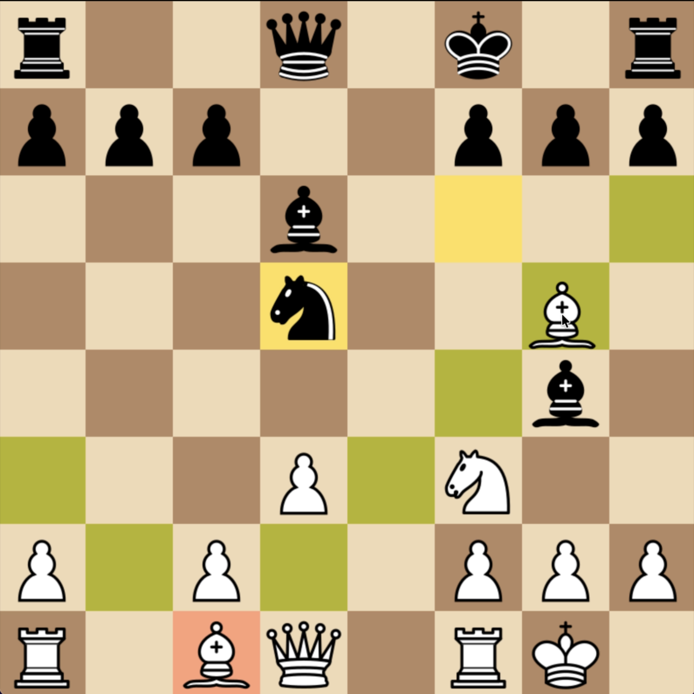

# ChessEngine



Play chess on a Pygame board and explore how search and evaluation choose a move.

## Features

- A graphical board with piece selection, move highlights, and check feedback.
- Legal move handling through `python-chess`.
- Minimax and alpha-beta search, move ordering, and persistent transposition tables.
- Experimental TensorFlow policy/value-network code in `A0NN.py`.

The image is an existing project screenshot from the portfolio; it is not a new engine-strength benchmark.

## Development

Python with `pygame`, `python-chess`, `numpy`, and `tensorflow` is required by the current imports. Run from the repository root so relative piece and data paths resolve:

```sh
python3 testmain.py
```

`testmain.py` is the interactive entry point; `savingtsptables.py` contains the search; `initi.py` and `var.py` define the board UI. Piece loading currently uses the lowercase path `pieces` while the tracked directory is `Pieces`, so case-sensitive systems need that path reconciled.

[Original milestones and issues](https://github.com/IERoboticsClub/ChessEngine/issues).
